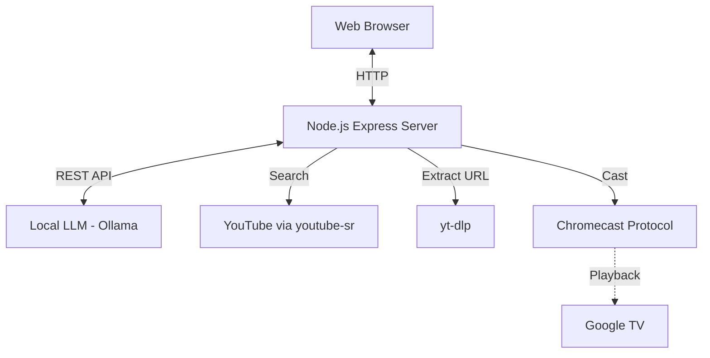

# Technical Design Document (TDD)

## Architecture



## Tech Stack
- **Backend**: Node.js + Express
- **Frontend**: Vanilla HTML5 + CSS3 + JavaScript
- **AI**: Ollama (local LLM, e.g., llama3.1)
- **YouTube Search**: `youtube-sr` (no API key needed)
- **Stream Extraction**: `yt-dlp` (installed via Homebrew)
- **Casting**: `castv2-client` + SSDP discovery

## Data Flow

1. **User** types "Play Daft Punk" in chat
2. **Ollama LLM** understands intent, outputs: `{"tool": "play_song", "query": "Daft Punk"}`
3. **youtube-sr** searches YouTube, returns video IDs
4. **yt-dlp** extracts the actual stream URL from YouTube
5. **castv2-client** casts the stream to the selected Chromecast device
6. **LLM** generates a fun DJ confirmation message

---

## What Didn't Work (Lessons Learned)

### ❌ Spotify Web API
**Why we tried it:** Original plan was to use Spotify for music playback.

**What happened:** Spotify has paused new developer app registrations (as of Jan 2026). The dashboard shows "New integrations are currently on hold."

**Lesson:** Always have a backup plan for third-party APIs. Spotify's ecosystem is locked down.

---

### ❌ DIAL Protocol for YouTube (`/apps/YouTube`)
**Why we tried it:** DIAL (Discovery and Launch) is the official protocol for launching apps on Chromecast. YouTube mobile apps use this to cast.

**What happened:** 
- `GET http://192.168.86.36:8008/apps/YouTube` returned **404 Not Found**
- `GET http://192.168.86.36:8008/apps/Netflix` returned **200 OK** (Netflix works!)

**Why it failed:** Google removed DIAL support for YouTube on Chromecast devices in favor of their proprietary Cast SDK. Only Netflix and a few other apps still support DIAL.

**Lesson:** DIAL is deprecated for YouTube. Don't waste time on it.

---

### ❌ Direct YouTube URLs via DefaultMediaReceiver
**Why we tried it:** Cast a YouTube watch URL (e.g., `https://www.youtube.com/watch?v=xxx`) directly.

**What happened:** Chromecast connects, shows the loading screen, but video never plays. Just shows a blank screen with Chromecast logo.

**Why it failed:** YouTube URLs are not direct video files - they're web pages that require JavaScript to play. The DefaultMediaReceiver can only play actual media streams (mp4, mp3, etc.).

**Lesson:** YouTube URLs ≠ video files. You need to extract the actual stream.

---

### ❌ `ytsr` npm package (YouTube Search)
**Why we tried it:** Popular library for searching YouTube without an API key.

**What happened:** Constant errors about unknown view types:
```
Error: type lockupViewModel is not known
Error: type gridShelfViewModel is not known
```

**Why it failed:** YouTube frequently changes their frontend. `ytsr` is deprecated and unmaintained, so it breaks when YouTube updates.

**Lesson:** Use `youtube-sr` instead - it's more actively maintained.

---

### ❌ `chromecast-api` npm package
**Why we tried it:** Simpler API than `castv2-client`.

**What happened:** Same issue as DefaultMediaReceiver - couldn't play YouTube URLs directly.

**Why it failed:** Same underlying limitation. No library can cast YouTube URLs without extracting the stream first.

**Lesson:** The casting library doesn't matter - you need `yt-dlp` to get actual streams.

---

## What Worked ✅

### yt-dlp + castv2-client
**The winning combination:**

1. **yt-dlp** extracts the actual video stream URL from YouTube
   ```bash
   yt-dlp -f "best[ext=mp4]" --get-url "https://www.youtube.com/watch?v=xxx"
   # Returns: https://rr5---sn-xxx.googlevideo.com/videoplayback?...
   ```

2. **castv2-client** casts that direct URL to the Chromecast
   ```javascript
   const media = {
       contentId: streamUrl,  // The googlevideo.com URL
       contentType: 'video/mp4',
       streamType: 'BUFFERED'
   };
   player.load(media, { autoplay: true });
   ```

**Why it works:** The stream URL is an actual video file that Chromecast can play natively.

**Caveat:** Stream URLs expire after a few hours. Each play request needs a fresh extraction.

---

## Verification

| Test | Result |
|------|--------|
| Chromecast Discovery (SSDP) | ✅ Found 8 devices |
| YouTube Search | ✅ Working |
| yt-dlp Stream Extraction | ✅ Working |
| Cast to Den TV | ✅ **Playing!** |
| DJ Persona Chat | ✅ Working |
